# TessellationTable

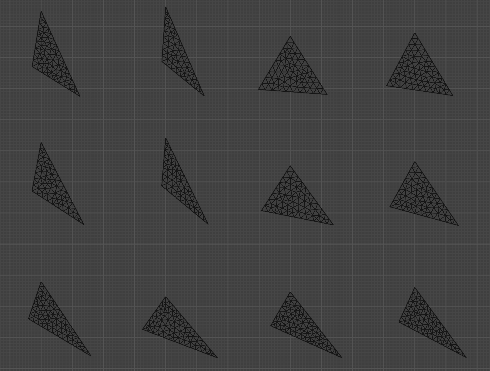

This repository contains a public-domain, clean-room implementation of a tessellation table for pattern-based adaptive mesh refinement, based on publicly described prior work and academic literature.

Work in progress as of time of writing this document, more features coming later.

# Background and Prior Work

This project builds on work by [Brian Karis](https://graphicrants.blogspot.com/2026/02/how-to-tessellate.html) from Epic Games in the context of Nanite tessellation.

Brian developed the specific triangle layouts and indexing needed to reuse a small number of refinement patterns. Brian points out that the same idea was independently developed in [Optimized Pattern-Based Adaptive Mesh Refinement Using GPU by Lenz et al](https://www.researchgate.net/publication/221337741_Optimized_Pattern-Based_Adaptive_Mesh_Refinement_Using_GPU).

In turn, that paper references [A Flexible Kernel for Adaptive Mesh Refinement on GPU by Boubekeur et al.](https://inria.hal.science/inria-00260825/document/), which lays out the original idea of encoding tessellation patterns into precomputed tables.

[NVidia vk_tessellated_clusters](https://github.com/nvpro-samples/vk_tessellated_clusters) sample uses the tessellation table from Unreal Engine directly (with permission from Epic Games).

This project sits at the end of that trail, pulling together those ideas into a standalone, public-domain implementation.

# Implementation

Requirements: [Blender](https://www.blender.org/), this table was generated using version 5.0.1

High level overview:

1. Generate all valid combinations of unique triangle subdivisions (816 in total)
2. Tessellate each triangle and flag failed/suspicious cases
3. Review and manually adjust failed cases.

## Initial triangle

Each starting triangle edge has to be subdivided into segments that have length of 1 Blender unit.

So the length of each triangle edge is defined as `number_of_cuts + 1`

Unfortunately, a lot of these triangles simply doesn't exist - 3 exact numbers does not always satisfy triangle inequality rule.

To solve this, an iterative fitting approach is used.

```python
bm = create_triangle((-1, -1, 0), (1, -1, 0), (0, 1, 0)) # Start with equilateral triangle

longest_edge = max([cuts_a+1, cuts_b+1, cuts_c+1]) / (max_cuts+1)

target_edge_0 = (cuts_a+1)/(max_cuts+1)
target_edge_1 = (cuts_b+1)/(max_cuts+1)
target_edge_2 = (cuts_c+1)/(max_cuts+1)

max_iterations = 100
iteration = 0
while iteration < max_iterations:
    iteration=iteration+1
    
    scale_edge_0 = target_edge_0/bm.edges[0].calc_length()
    scale_edge_1 = target_edge_1/bm.edges[1].calc_length()
    scale_edge_2 = target_edge_2/bm.edges[2].calc_length()
    
    bmesh.ops.scale(bm, verts=bm.edges[0].verts, vec=(scale_edge_0, scale_edge_0, scale_edge_0))
    bmesh.ops.scale(bm, verts=bm.edges[1].verts, vec=(scale_edge_1, scale_edge_1, scale_edge_1))
    bmesh.ops.scale(bm, verts=bm.edges[2].verts, vec=(scale_edge_2, scale_edge_2, scale_edge_2))
```

Fitting gets the edge lengths as close to our target lengths as possible and makes sure that triangle actually exists.

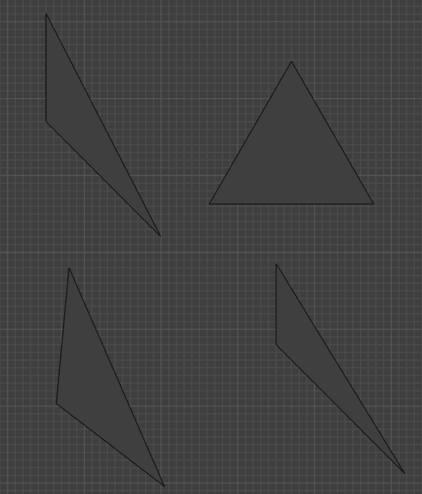

### Initial subdivision

After fitting, each edge is subdivided according to the tessellation pattern and triangulated.

```python
temp_edges = [bm.edges[0], bm.edges[1], bm.edges[2]]

bmesh.ops.subdivide_edges(bm, edges=[temp_edges[0]], cuts=int(cuts_a))
bmesh.ops.subdivide_edges(bm, edges=[temp_edges[1]], cuts=int(cuts_b))
bmesh.ops.subdivide_edges(bm, edges=[temp_edges[2]], cuts=int(cuts_c))
```

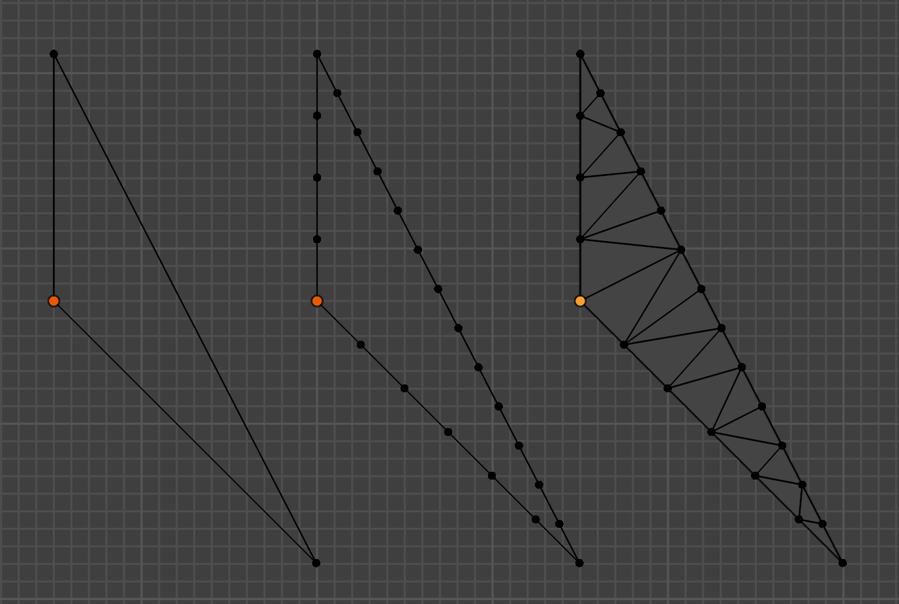

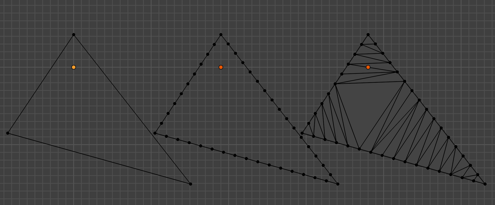

## Tessellation pattern generation

Generating tessellation patterns has 4 distinct operations that are performed in a specific order.

1. `Subdivide long edges` - find all "long" edges in the mesh and subdivides them all at once. "Long edge" is defined as "non-boundary edge that is longer than 120% of the shortest boundary edge length"
2. `Collapse short edges` - find all "short" edges in the mesh and collapse them all at once. "Short edge" is defined as "non-boundary edge that is shorter than 60% of the shortest boundary edge length"
3. `Relax vertices` - for each non-boundary vertex, compute the centroid of all adjacent vertices, then move vertex to that centroid
4. `Merge close vertices` - find all non-boundary vertices that are close to each other and merge them at centroid. "Close vertices" is defined as "length of the shared edge between two vertices is shorter than 60% of the shortest boundary edge length"
5. `Reset remeshing` - delete all non-boundary vertices, edges and faces and start over.

Note that `Collapse short edges` and `reset remeshing` are not used directly, but instead used for debugging.

### Tools

Each algorithm step is exposed in the UI and can be performed individually.


This is very useful for debugging the process and finding out when exactly something went wrong. The operators also support undo/redo natively - so the user can undo the failed step and go back to the previous working configuration at any time.

### Algorithm description

The following order of operations was produced after manually playing with the debugging UI, the working combination of steps was discovered empyrically.

As of today, the flow looks like this:

```
repeat up to 100 times:
    Subdivide long edges

    repeat up to 100 times:
        Merge close vertices
        Relax vertices

        if nothing was merged, then break the loop
    

    if nothing was subdivided, then break the loop
```

This produces very nice, uniformly dense tessellation patterns for most triangles. As mentioned earlier, `Collapse short edges` ended up not being used because `Merge close vertices` produced better results.

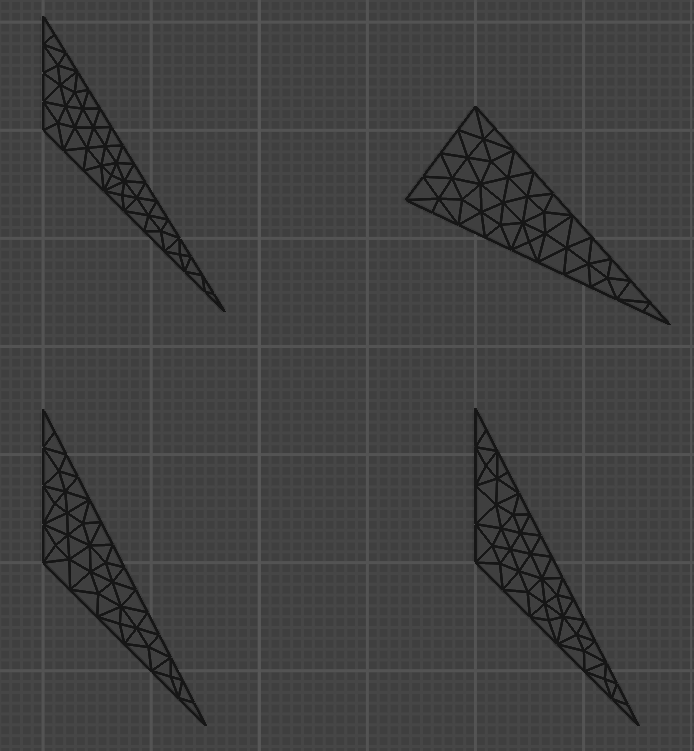

### Failed cases

667 out of 816 triangles have generated successfully, however 149 configurations either "failed" or were flagged for manual review.

All resulting configurations were inspected visually, including successfull ones, however this is prone to human error. Please report any issues if you find them.

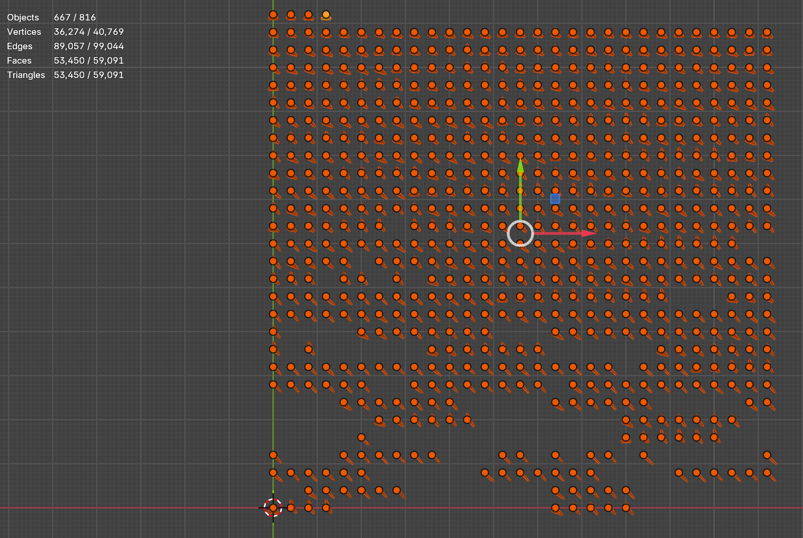

These are the criteria used to identify failed / suspicious cases that were flagged for manual review:

* Topology failure
* Resulting mesh has 3-pole vertices
* Resulting mesh has too short edges
* Resulting mesh has too long edges
* Resulting mesh has too small or too big triangles

#### Topology failure

Tessellation produced something completely unusable, for example overlapping faces, etc.

Overlapping faces                               | Intersecting edges with no vertex
:----------------------------------------------:|:-------------------------:
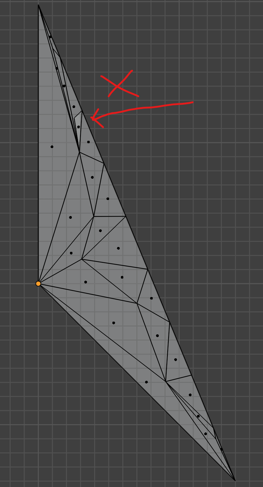 |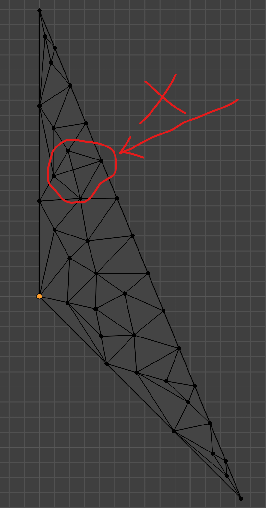

Detection method: check if any new boundary edges were created.

Solution: redo by hand, use the tools to step through the process and find when it fails, continue manually from there.

#### 3-pole vertices

3-pole vertex is defined as a non-boundary vertex that shares 3 or less edges.

This is not a failure, just flags the pattern for manual review.

Some of them are also flagged by edge length or triangle areas.

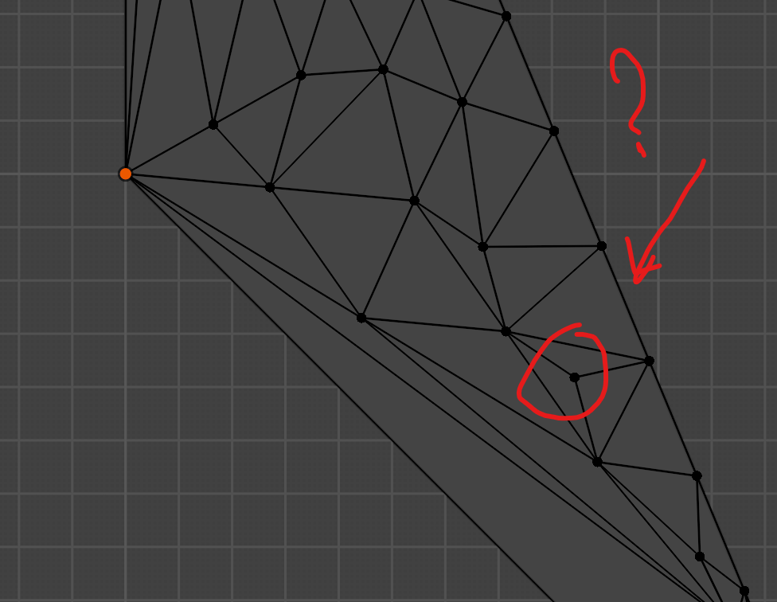

#### Too short edges

Want to avoid short edges when possible. Not always possible.

"Short edge" is defined as "non boundary edge that is shorter than 30% of the shortest boundary edge"

| Short edges                               | Manually relaxing vertices (optional)                |
|------------------------------------------:|:-----------------------------------------------------|
|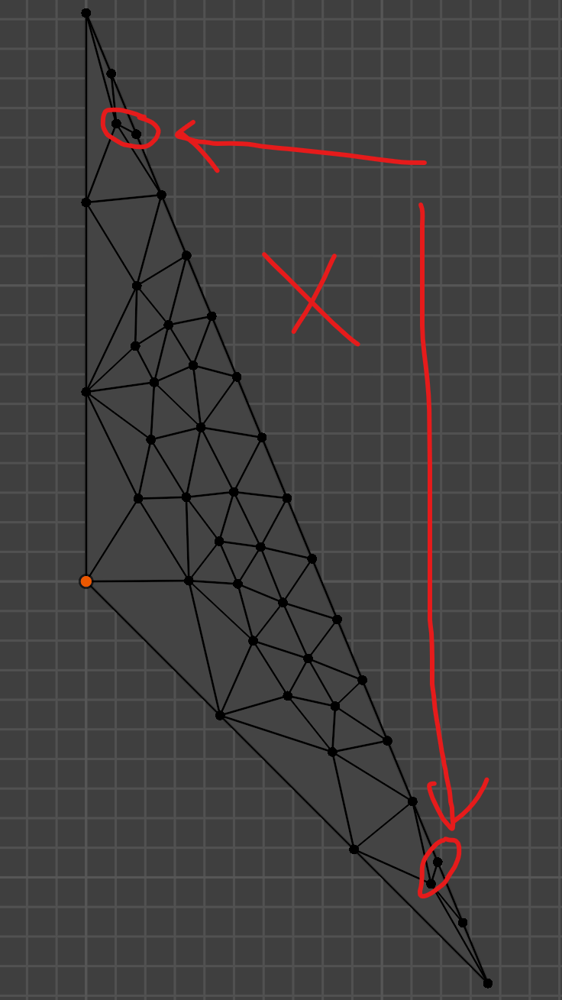   | 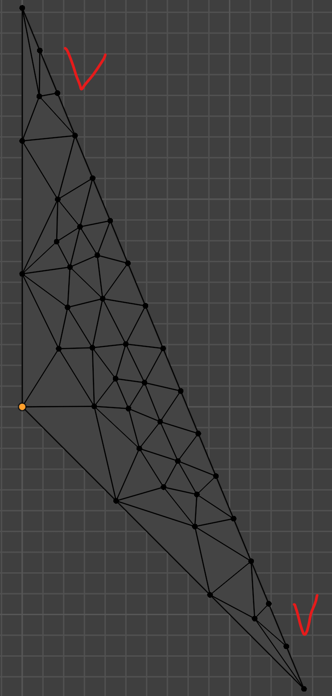 |

This is not a failure, just flags the pattern for manual review.

Doesn't need any adjustments in most cases.

#### Too long edges

Same as with short edges.

"Long edge" is defined as "non boundary edge that is longer than 130% of the shortest boundary edge"

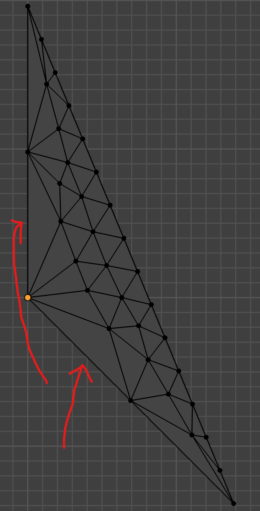

This is not a failure, just flags the pattern for manual review.

Doesn't need any adjustments in most cases.

#### Too small or too big triangles

Ideally triangles should be as uniform as possible. Not always possible.

|  Big triangles |  Manually tessellate  |
|-----------------------------------------------|--------------------------------------------------|
| 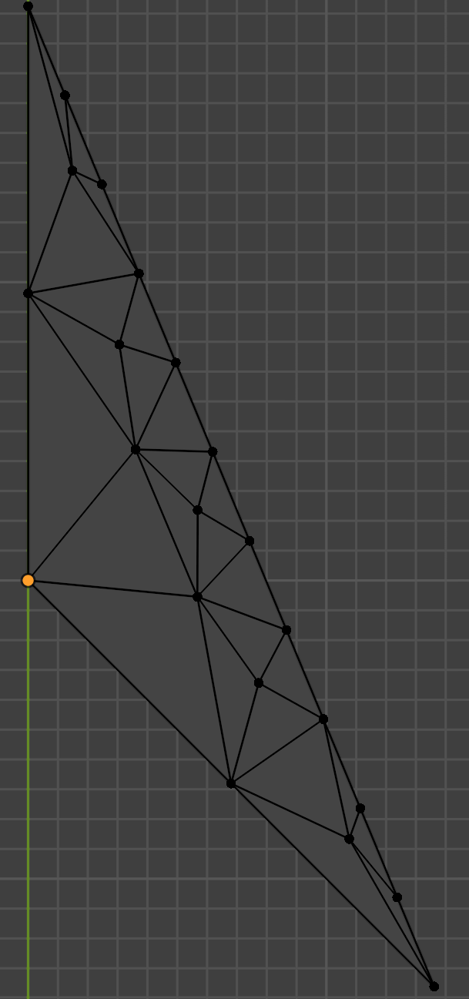  | 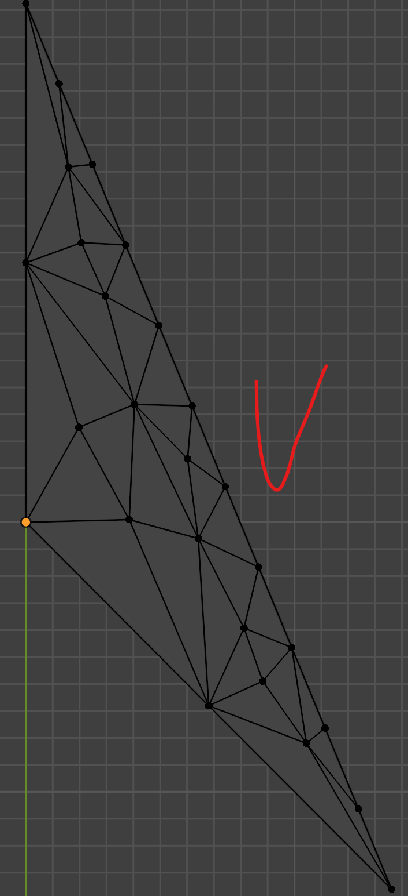  |
 
Detection: find minimum and maximum area of all triangles, check if their ratio is within 10% of each other.

Solution: manually tessellate if needed. Only needed in a very few cases.

# Work in progress / TODO

* Export the table data to be usable in the game engine
* Compress barycentrics
* Run meshoptimizer on the patterns

# Future work

This approach trivially extends to tessellating quadrilaterals. Whether this is practically usable or not is unclear at the moment.

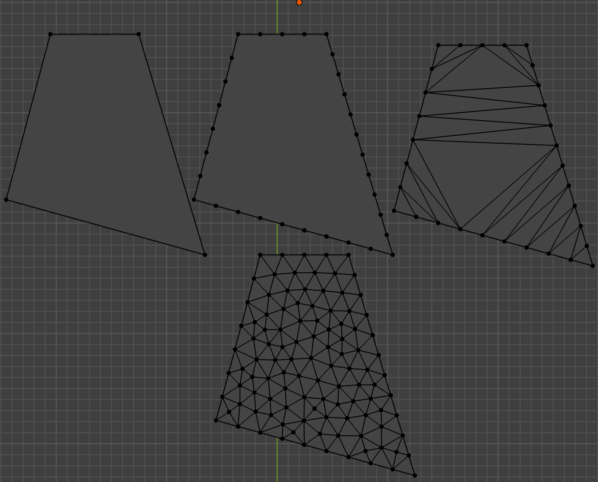

# References / links

* [How to tessellate by Brian Karis](https://graphicrants.blogspot.com/2026/02/how-to-tessellate.html)
* [vk_tessellated_clusters by NVidia](https://github.com/nvpro-samples/vk_tessellated_clusters)
* [Optimized Pattern-Based Adaptive Mesh Refinement Using GPU by Lenz et al](https://www.researchgate.net/publication/221337741_Optimized_Pattern-Based_Adaptive_Mesh_Refinement_Using_GPU)
* [A Flexible Kernel for Adaptive Mesh Refinement on GPU by Boubekeur et al.](https://inria.hal.science/inria-00260825/document/)
